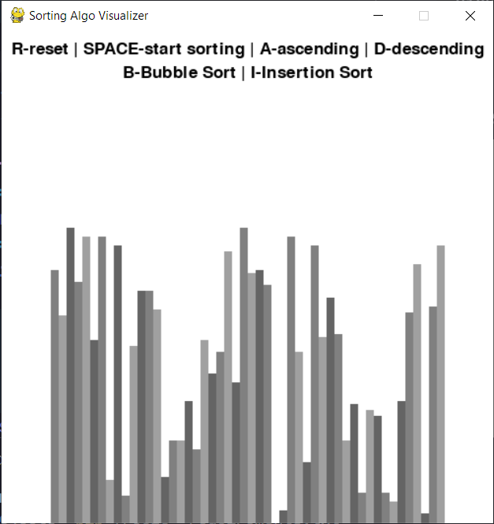
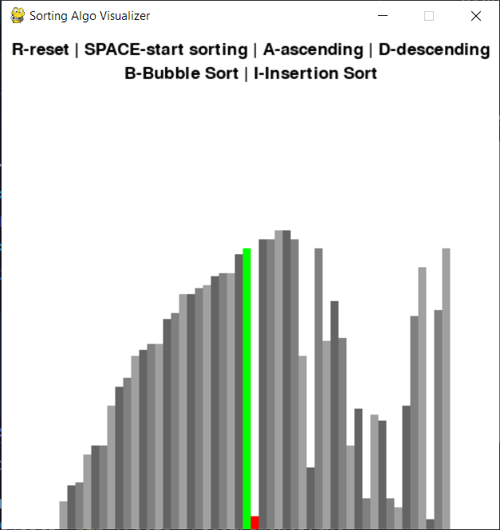
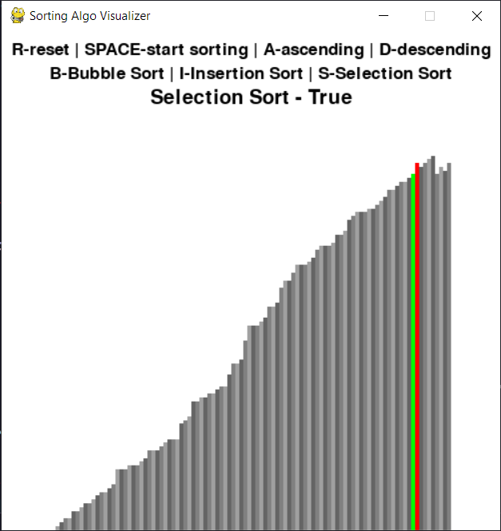

# Python Sorting Algorithms Visualizer

Python project to visualize different sorting algorithms using the pygame library.


## Installation

Install the required modules with their correct versions(versions i used)

```bash
git clone https://github.com/PrabhjotSingh24/sorting-visualizer.git

pip install requirements.txt
```
    
## Screenshots




